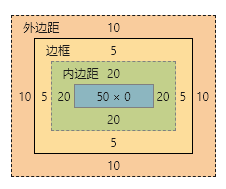

### 盒子模型是什么
> 在页面布局时候，dom元素所采用的布局模型，就是通俗意义上的盒子模型。

```html
<!doctype html>
<html lang="en">
<head>
    <meta charset="UTF-8">
    <meta name="viewport"
          content="width=device-width, user-scalable=no, initial-scale=1.0, maximum-scale=1.0, minimum-scale=1.0">
    <meta http-equiv="X-UA-Compatible" content="ie=edge">
    <title>Document</title>
    <style>
        .box{
            width: 100px;
            height: 30px;
            margin: 10px;
            padding: 20px;
            border: 5px solid chocolate;
        }
    </style>
</head>
<body>
    <div class="box">
        content
    </div>
</body>
</html>
```
#### 1. 盒子模型包括 `外间距-边框-内间距-内容` 4个部分。打开浏览器F12查看, 可以清晰的看到盒子的外边距-边框-内边距和最后的内容构造，这就是整个盒子模型


#### 2. 常见的盒子模型又两种,可以通过box-sizing进行设置 

1. `border-box` (IE盒子模型)
2. `content-box` (W3C标准盒子模型)
    - 现在我们添加属性`box-sizing:border-box`,可以明显的看到我们定义的宽度`width(100px) = content(50px) + padding(40px) + border(10px)`，
    那么盒子的宽度就是`width(100px) + margin(20px) = 120px`
    
    
    
    - 修改`box-sizing: content-box`,可以看到`width(100px) = content(100px)`，
    那么盒子的宽度就是`width(100px) + padding(40px) + border(10px) + margin(20px) = 170px`
    
    

#### 3. 外边距的问题
> 相邻的两个元素之间的间距，取最大
```html
<style>
.box2{
    width: 50px;
    height: 10px;
    margin: 20px;
    padding: 30px;
    border: 10px solid seagreen;
}
</style>
<div class="box">
    content
</div>
<div class="box2">
    content2
</div>
```
- 这里我们可以看到两个盒子相邻的外边距，是最大的box2的外边距


#### 4. 由于ie的怪异盒子模型，导致的浏览器显示不一致的解决办法
> 相信大家不难发现，相比较border而言，我们的关键问题在于padding(border较少),那么最佳的解决方案，就是能用margin，就不用padding。
> 但是有些情况，不是说不用padding就能解决的。那怎么办呢？这里我们能发现，所有的一切都是因为width 和padding/border 同时使用造成的。
> 那么最终的解决方案就出来了。
> 可以在盒子内出定义一个无width的盒子，将padding 和boder 赋值到整个盒子上，外面的盒子。我们只给width和margin就可以了。
```html
<!doctype html>
<html lang="en">
<head>
    <meta charset="UTF-8">
    <meta name="viewport"
          content="width=device-width, user-scalable=no, initial-scale=1.0, maximum-scale=1.0, minimum-scale=1.0">
    <meta http-equiv="X-UA-Compatible" content="ie=edge">
    <title>Document</title>
    <style>
        .box{
            width: 200px;
            margin: 20px;
        }
        .content{
            padding: 20px;
            border: 5px solid chocolate;
        }
    </style>
</head>
<body>
    <div class="box">
        <div class="content">
            content
        </div>
    </div>
</body>
</html>
```
- 可以看到，我们里面的盒子虽然没有设置宽度，但是经过外面的盒子包裹，已经有200px的宽度了。正式外层盒子的宽度，但是同时又有padding 和border ，这样就可以完美的解决怪异盒子的问题。
