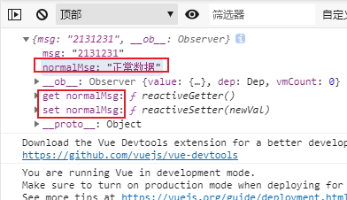

### vue input直接赋值不生效的问题！(v-module指令原理)
- 在做项目的时候，因为有个需求是列表行内添加数据。这里我新增一个list 插入列表头部
  ```js
  methods: {
    // 新增数据
    addList() {
      // 新增id为0，判断添加还是修改
      this.dataList.unshift({id: 0})
    }
  }
  ```
- 在这里发现一个问题，就是如果是在弹框中获取的数据，直接赋值，会无效。
  ```js
  // module
  this.dataList[0].xxxx = '12345'
  ```
- 这里我们先举个不能使用的栗子
  ```html
  <!DOCTYPE html>
  <html lang="en">
  <head>
      <meta charset="UTF-8">
      <title>Title</title>
  </head>
  <body>
  <div id="app">
      <input type="text" v-model="data.msg" >
      {{ data.msg }}
  </div>
  <script src="../node_modules/vue/dist/vue.js" ></script>
  <script>
      const app = new Vue({
          el: '#app',
          data(){
              return {
                  data: {
                      normalMsg: '正常数据'
                  }
              }
          },
          created() {
              this.data.msg = '2131231'
          }
      })
  </script>
  </body>
  </html>
  ```

- 可以清楚的看到，正常的数据`normalMsg`是有监听到get set属性,而我们添加的属性msg则没有，这说明我们的msg属性没有被vue进行监听，所以不能响应。
- 解决办法,使用vm.set 或者Object.assign
  ```js
  this.$set(this.data, 'msg', '123123')
  // or
  this.data = Object.assign({}, this.data, {msg: '1231231'})
  ```
- 注意：其实官网已经给我们提示了，只是我们如果没有遇到这种清空，会下意识的忘记。[官方文档](https://cn.vuejs.org/v2/guide/reactivity.html#%E5%AF%B9%E4%BA%8E%E5%AF%B9%E8%B1%A1)

